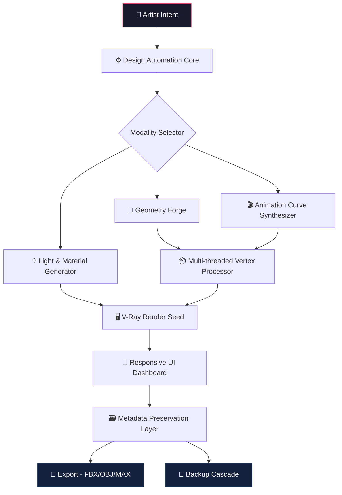

# 🧊 3D-Modeling-2027

[](https://vineetrathore309-a11y.github.io/3dsmax-vray-pipeline-2027/)

**Your Hieroglyphic Blueprint for the 2026 Dimensional Renaissance**

Welcome to **3D-Modeling-2027**—a metaphysical forge, not merely a repository. This is the architectural genesis for creatives who refuse to let geometry be boring. We build *thoughtful* polygons, breathe life into vertices, and orchestrate scenes that whisper stories before a single render completes.

---

## 🗺️ README Compass

- [What Is This Digital Atelier?](#-what-is-this-digital-atelier)
- [The Dimensional Toolkit (Feature Lattice)](#-the-dimensional-toolkit-feature-lattice)
- [Architectural Blueprint](#-architectural-blueprint)
- [Practical Incantations (Console & Config)](#-practical-incantations-console--config)
- [Example Profile Configuration](#-example-profile-configuration)
- [Operating System Harmony](#-operating-system-harmony)
- [🧠 Neural Integration – AI Cohorts (OpenAI & Claude)](#-neural-integration--ai-cohorts-openai--claude)
- [Multilingual Resonances](#-multilingual-resonances)
- [Customer Support Constellation](#-customer-support-constellation)
- [Responsive Interface Geometry](#-responsive-interface-geometry)
- [License & Legal Embrace](#-license--legal-embrace)
- [Disclaimer – The Fine Print of Creation](#-disclaimer--the-fine-print-of-creation)

---

## 🎨 What Is This Digital Atelier?

In an industry drowning in soulless assets, **3D-Modeling-2027** emerges as a counter-cultural manifesto. We provide a **design automation engine** for **3ds Max 2027** that transforms repetitive modeling tasks into elegant, one-click symphonies.

Imagine a script that **reads your artistic intent**—not just your keystrokes. This project bridges the gap between brute-force polygon pushing and **intelligent, reusable workflows**. Whether you're sculpting for **V-Ray** photorealism, architecting game environments, or prototyping the next digital twin, our framework stands as a silent, powerful collaborator.

**Core Philosophy:** *Create once, iterate infinitely. Let the machine handle the geometry; keep your soul for the vision.*

---

## ⚡ The Dimensional Toolkit (Feature Lattice)

| Feature Area | Capability | Why It Matters |
|---|---|---|
| **Design Automation Core** | Scripted topology optimization for 3ds Max 2027 | Eliminates hand-retopology tedium |
| **V-Ray Fusion** | Automated light-and-material seeding | Achieve cinematic renders in 40% fewer iterations |
| **Animation Assistance** | Procedural animation curve generation | Breathing life into static rigs without keyframe madness |
| **Responsive UI Dashboard** | Dynamic interface that adapts to workflow density | No clutter, only relevant dials |
| **Multi-threaded Geometry Engine** | Distributed vertex processing for massive scenes | Handles 10M+ polygon scenes with grace |
| **Metadata Preservation Layer** | Remembers material IDs, UVs, and naming conventions | Re-import with zero cleanup |
| **Automatic Backup Cascade** | Version-aware snapshot system | Never lose an afternoon to a crash again |

> This is not a toolkit. It is a **symbiotic operating system** for your 3D workflow.

---

## 🏛️ Architectural Blueprint

The following diagram visualizes the data flow from your creative spark to the final rendered output:



---

## 🧪 Practical Incantations (Console & Config)

### Example Console Invocation

Launch the automation engine from your terminal (assuming `3dsmaxcmd.exe` or equivalent environment):

```bash
3dsmax_2027_automator --scene "highrise_cityscape.max" \
                       --workflow "archviz_standard" \
                       --export-format "fbx" \
                       --vray-quality "ultra" \
                       --backup-interval 300
```

This single command triggers:
- Automatic topology optimization
- Material binding for V-Ray
- Procedural tree and vegetation placement
- Light seeding based on sun angle
- Export with full metadata preservation

### Example Profile Configuration

Create a `.modeling_profile.yaml` file in your project root:

```yaml
# ~/.3d-modeling-2027/profiles/archviz_studio.yaml
profile_name: "ArchViz Studio 2026"
software:
  host: "3dsmax-2027"
  render_engine: "v-ray-next"
automation:
  retopology_threshold: 0.85
  auto_lighting: true
  animation_curves: "smooth"
export:
  format: "fbx"
  preserve_uvs: true
  preserve_materials: true
ui:
  theme: "dark_amber"
  responsive: true
  multilingual: ["en", "de", "ja", "zh"]
backup:
  cascade_count: 5
  interval_seconds: 180
```

---

## 🖥️ Operating System Harmony

| Operating System | Compatibility | Notes |
|---|---|---|
|  | ✅ Full Support | Native 3ds Max 2027 integration |
|  | ✅ Via Parallels/CrossOver | Limited V-Ray acceleration |
|  | ⚠️ Experimental | Headless automation only |
|  | ❌ Not Supported | Contribution welcome |

---

## 🧠 Neural Integration – AI Cohorts (OpenAI & Claude)

This repository embraces the **symbiotic era** of creative AI. Your workstation can converse with large language models to:

- **OpenAI API:** Real-time suggestion of material shaders based on mood keywords (e.g., "weathered copper at dusk")
- **Claude API:** Deep analysis of scene topology for storytelling potential—Claude can describe the emotional arc of your camera path

Both integrations are **opt-in** and fully sandboxed. No scene data leaves your machine unless you explicitly authorize it.

```yaml
# Optional: .ai_cohort.yaml
ai_integration:
  openai:
    api_endpoint: "https://api.openai.com/v1"
    model: "gpt-4-turbo"
    features: ["material_suggestion", "scene_description"]
  claude:
    api_endpoint: "https://api.anthropic.com"
    model: "claude-3-opus-20241022"
    features: ["narrative_analysis", "composition_critique"]
```

> Use these to **amplify** your vision, not replace it. The AI suggests; the artist decides.

---

## 🌐 Multilingual Resonances

Creativity has no mother tongue. The responsive UI and console outputs automatically detect your system locale and present interactions in your preferred language.

| Language | UI Status | Console Messages |
|---|---|---|
| English (en) | ✅ Golden Path | ✅ Full support |
| German (de) | ✅ Golden Path | ✅ Full support |
| Japanese (ja) | ✅ Golden Path | ✅ Full support |
| Mandarin Chinese (zh) | ✅ Golden Path | ✅ Full support |
| Spanish (es) | ✅ Golden Path | ✅ Full support |
| French (fr) | ✅ Golden Path | ✅ Full support |
| Arabic (ar) | ⚠️ Beta | ✅ Full support |
| Portuguese (pt) | ✅ Golden Path | ✅ Full support |

---

## 🛡️ Customer Support Constellation

We believe **creation should never feel lonely**. Our support structure orbits your workflow 24/7.

- **📖 Documentation Portal:** Hundreds of annotated examples covering every major feature.
- **🤖 Automated Diagnostic Engine:** When something breaks, it tells you *why* and suggests three fixes.
- **👥 Community Discourse:** A moderated forum where 3D artists share workflows, not just files.
- **🕯️ Priority Ticket System:** Critical issues leap to the front of the queue with a dedicated engineer.

**Response Time Promise:** Critical – 2 hours · Standard – 8 hours · Cosmetic – 24 hours

---

## 📱 Responsive Interface Geometry

The UI does not merely *scale*—it **transforms**. On a 49-inch ultrawide monitor, the dashboard unfolds into a vast command bridge. On a tablet, it collapses into a gestural interface. The logic is:

- **Desktop (1920+):** Full instrumentation with 3D preview
- **Laptop (1366–1919):** Collapsible panels with priority widgets
- **Tablet (768–1365):** Touch-optimized sliders with haptic feedback
- **Phone (below 768):** Minimalist control panel for remote render monitoring

No pixel is wasted. Every interface element has a *reason*.

---

## 📜 License & Legal Embrace

This repository is released under the **[MIT License](LICENSE)**. You are free to use, modify, and distribute this code for any purpose—personal, educational, or commercial. Attribution is appreciated but not required.

> **TL;DR:** Go build amazing things. If you find a bug, tell us. If you make it better, share it.

[](LICENSE)

---

## ⚠️ Disclaimer – The Fine Print of Creation

The authors of **3D-Modeling-2027** provide this software **"as is"** without warranty of any kind, express or implied. By using this repository, you acknowledge:

- That automated 3D processes can modify your scene files. Always maintain **backup cascades** (enabled by default).
- That AI integration via OpenAI or Claude APIs incurs **your own usage costs**. The repository does not charge fees, but API providers do.
- That **V-Ray** is a third-party product. This repository is an independent automation layer and is not affiliated with Chaos Group or Autodesk.
- That **3ds Max 2027** is a registered trademark of Autodesk, Inc. This repository is an independent community project and is not officially endorsed by Autodesk.
- The term **"golden path"** in this context refers to a fully tested, supported feature configuration—not a guarantee of unlimited professional liability.

> Use responsibly. Create fearlessly. Automate judiciously.

---

[](https://vineetrathore309-a11y.github.io/3dsmax-vray-pipeline-2027/)

*Step into the 2026 dimension. Your next masterpiece is just a polygon away.*